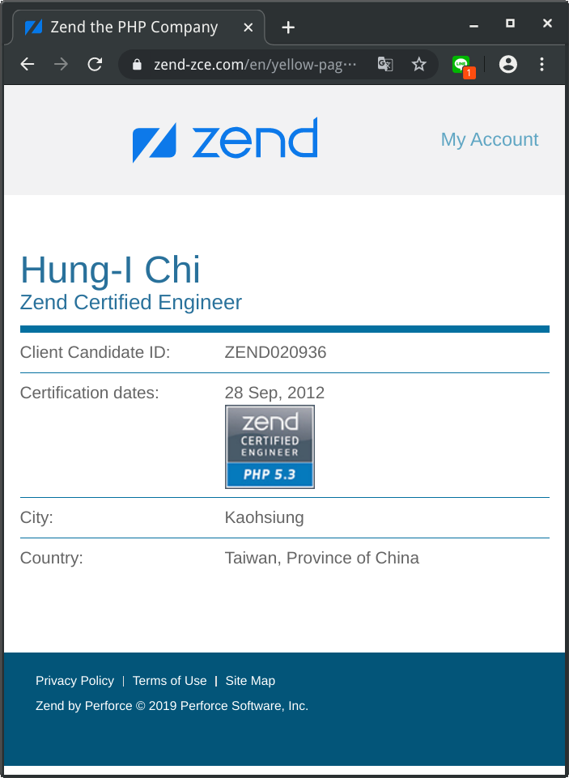
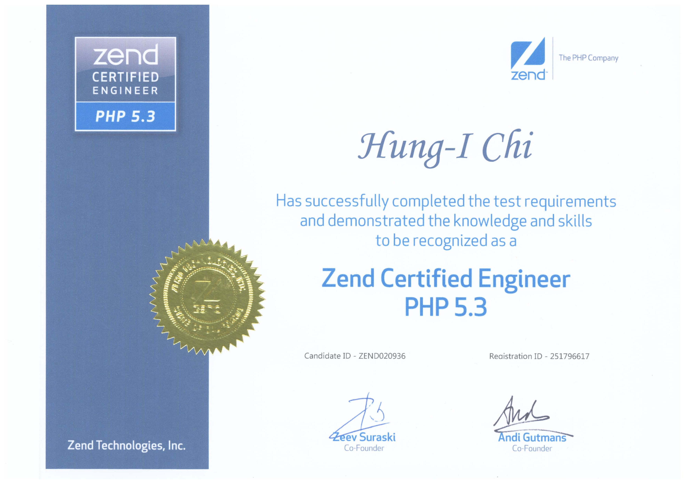
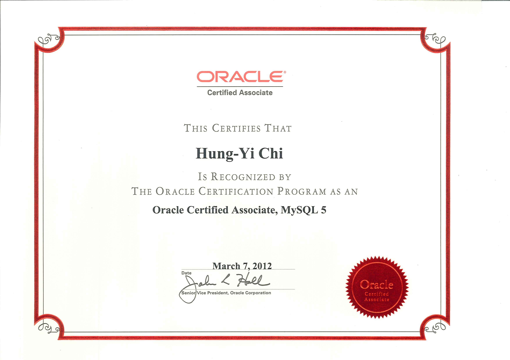

### 第零章 課前說明
#### 課程教材使用方式
+ Github 線上帳號申請
  + 練習 Git 版控
  + 放置你自己的專案
  + 放置課堂練習的程式
  + 練習佈署程式
+ 課堂下載檔案
  + 課程講義下載
    + 使用 README.md 為檔案名稱
    + 下載後，請自行上傳至 Github 站台上觀看
  + 練習程式與題目下載
    + 程式寫完後，請 git 上 Github
    + 利用 git 佈署程式至正式機上，執行程式
  + 建置環境程式下載
    + VirtualBox
    + CentOS 8 iso 檔案
    + Visual Studio Code
  
#### 專案製作
+ 專案構思與製作
  + 請開始構思網站功能
    + 請利用 Visual Studio Code 寫下這些功能名稱與作用
    + 將每個功能運作細節寫出來
    + 實作過程中，可修正不合理/無法實作的部份
    + 不要偏離目標太遠
+ 程式碼放置於 GitHub 站台
  + 利用 git 推送程式碼
  + 過程中可學習版控的方式與精神
  + 可看見自己的學習歷程
  + 完成後就是好的宣傳作品
  
#### 證照考試
+ 國內證照考試
  + [TQC MySQL](https://www.tqc.org.tw/TQCNet/CertificateDetail.aspx?CODE=hzuv6/UBs2Q=)
+ 國外證照考試
  + [Zend PHP](https://www.zend.com/training/php-certification-exam)
  + ZCE 線上查詢
    + 
    + 
  + [Oracle MySQL](https://education.oracle.com/mysql/mysql-database-administration/product_159)
  + MySQL 證照
    + 
#### 程式開發流程與佈署認知
+ 了解網站應用系統架構
+ 開發環境與正式環境需求
+ 版控需求與應用
+ 佈署流程的認知