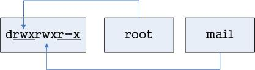

### 第二章 Linux 作業系統基本操作
#### 指令使用方式
+ 文字介面開啟方式
  + Terminal 終端機視窗
    + 圖形介面下開啟文字介面方式
  + Console 文字介面切換
    + \<Ctrl>+\<Alt>+\<F2>~\<F6>
    + \<Ctrl>+\<Alt>+\<F6>
+ 命令提示字元
  + [使用者身份＠主機名稱　現在工作目錄]#
  + #: 管理者身份
  + $: 一般使用者身份
+ 指令下法
  + #指令名稱   參數  引數
  + 指令名稱：Linux 指令，例如： ls
  + 參數：改變指令執行規則，例如：-h or --help
  + 引數：指令執行對象，例如：/etc/hosts
  + 範例：
    + #cd ~      切換目錄到家目錄
    + #ls -al    列出當下的目錄內容
    + #ls -al /var/log    列出 /var/log/　目錄底下的子目錄與檔案

#### 檔案與目錄管理
+ Linux 檔案與目錄架構
  + 最上層根目錄－「 / 」
  + 沒有 C: D: E: ...
  + Linux 標準階層目錄(FHS)說明：
  
    | 目錄名稱      | 使用說明                             |
    |:--------------|:-------------------------------------|
    | /             | 根目錄：Linux 最頂層目錄             |
    | /root         | Linux 最大管理者 root 的家目錄       |
    | /home         | Linux 一般使用者家目錄               |
    | /etc          | Linux 軟體設定檔目錄                 |
    | /dev          | Linux 硬體設定檔目錄                 |
    | /lib、/lib64  | Linux 涵式庫目錄                     |
    | /bin、/sbin   | Linux 系統或軟體執行檔目錄           |
    | /usr          | Linux 應用軟體套件安裝目錄           |
    | /mnt、/media  | Linux 可移動媒體檔案系統掛載點目錄   |
    | /var          | Linux 各式文件檔案放置目錄           |
    | /boot         | Linux 開機選單以及核心檔案放置目錄   |

+ 檔案與目錄管理指令
  + 常用指令列表：

    ||檔案|目錄|
    |:---:|---|---|
    |新增|touch、vim、nano|mkdir|
    |修改|vim、mv、nano|mv|
    |刪除|rm|rmdir、rm -rf|
    |查詢|less、more、cat、find|ls、find|

  + 例：
    <pre><code>#mkdir /tmp/hello
    #touch /tmp/hello/test1
    #nano /tmp/hello/test1
    #ls -al /tmp/hello/test1
    #less /tmp/hello/test1
    #cat /tmp/hello/test1
    #rmdir /tmp/hello
    #rm /tmp/hello/test1
    #rm -rf /tmp/hello</code></pre>

  + 其他常用指令：
    + ll: 與 ls 功能相同
    + ln: 建立連結目錄
    + alias: 建立指令別名
    + 例：
      <pre><code>#ln -s /etc/hosts /tmp/hosts
      #ll /tmp/hosts
      #rm /tmp/hosts
      #alias</code></pre>

#### 使用者與群組管理
+ 使用者與群組概念
  + 系統中每一個執行程式，都需要有使用者來啟動
    + 系統程式，需要系統使用者來啟動執行
    + 應用服務，需要應用程式使用者來啟動執行
  + 一般使用者需要有自己使用者帳號，才可以登入系統
    + 登入系統時，需要密碼才可以登入
    + 登入時，系統會驗證並且記錄使用者相關資訊
+ 使用者與群組的建立
  + 每建立一個新使用者，就會產生一個與新使用者同名的新群組！
    + Private Policy
    + 新使用者為新群組的當然成員，稱為該新使用者的主要群組！
    + 群組可個別新增
    + 使用者必須透過有管理權限的使用者，才可加入群組！
    + 使用者所加入的其它群組，稱為次要群組
    + 每一個使用者只能有一個主要群組，但可加入多個次要群組！
  + 使用者管理檔案
    + /etc/passwd
    + /etc/shadow
  + 群組管理檔案
    + /etc/group
    + /etc/gshadow
   
+ 使用者與群組管理指令
  + 指令列表：

  ||使用者|群組|
  |:---:|:---:|:---:|
  |新增|useradd|groupadd|
  |修改|usermod、passwd|groupmod、gpasswd|
  |刪除|userdel|groupdel|
  |查詢|id、who、w、whoami|id|

  + 例：
    <pre><code>#useradd student
    #passwd student
    #id student
    #groupadd golf
    #usermod -aG golf student
    #id student</code></pre>

#### 基本權限管理
+ Linux 權限概念
  + 權限基本精神：使用者對於資源的使用權利
    + 針對使用者所開放的權限
    + 針對群組所開放的權限
    + 針對其它人所開放的權限
    + 資源：檔案與目錄
  + 權限種類：
    + r : read
    + w : write
    + x : execute
    + s : super uid / gid 
    + t : stick bit
    + \- : closed
  + 權限與使用者群組的相依性：
    + 查詢指令範例：
    <pre><code># ls -al /etc/hosts
    -rw-r--r--. 1 root root 325  7月 23 06:21 /etc/hosts</code></pre>
    + 各組權限說明圖
      + 
      + 權限每三個一組
      + 每組各有 r、w、x 等三個權限可設定
      + 每一組權限針對不同的角色做限定
      + 權限值第一個值為檔案類型：
        + \- : 表示一般檔案
        + d : 表示該檔案為目錄
        + l : 表示該檔案為軟連結檔(捷徑檔)
        + s : 表示 socket 類型檔案
        + p : 表示管線通訊類型檔案
        + c : 表示卡類設備
        + d : 表示儲存設備
      + 權限可以使用數字表示：
        + r : 4
        + w : 2
        + x : 1
        + \- : 0
        + 每組權限數字相加後為權限代表值，例：
          + rwxr-xr-- : 754
          + rw-r--r-- : 644
  
+ 權限管理指令
  + 修改檔案與目錄的所屬使用者與群組：

    |指令名稱|使用者或群組|檔案或目錄|
    |:---:|:---:|:---:|
    |chown|[使用者]:[群組]|檔案或目錄名稱|
    |chgrp|[群組]|檔案或目錄名稱|

    + 例：
      <pre><code>#touch /tmp/test123
      #ls -al /tmp/test123
      #chown student:root /tmp/test123
      #ls -al /tmp/test123</code></pre>

  + 修改檔案的權限值設定：

    |指令名稱|角色|運算符|權限值|檔案或目錄|
    |:---:|:---:|:---:|:---:|:---:|
    |chmod|u g o a| + \- = |r w x|檔案或目錄名稱|

    + 例：
      <pre><code>#touch /tmp/test
      #ls -al /tmp/test
      #chmod u+x,g-w,o=---  /tmp/test
      #ls -al /tmp/test
      </code></pre>

#### 軟體安裝與管理
+ Linux 軟體安裝概念
+ YUM 軟體安裝與管理

#### Web 站台架設
+ Nginx 套件安裝與啟用
+ PHP 套件安裝與啟用

#### 基本安全設定
+ 基本防火牆應用
+ SELinux 的基本應用

##### 參考文獻
+ [鳥哥的私房菜](http://linux.vbird.org/)