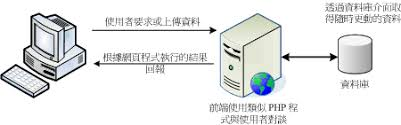

### 第六章 PHP 基本語法
#### PHP 基本觀念
+ 站台的運作方式
  + 靜態網站
    
    + 取自「鳥哥的私房菜」
  + 動態網站
    
    + 取自「鳥哥的私房菜」

+ PHP 的運作方式
  + PHP Engine
    

+ PHP 程式寫作方式
  + HTML 內嵌 PHP 程式標籤 :
    ```php
    <?php
      你的 php 程式碼;
    ?>
    ```
    + 範例 : hello.php
      ```html
      <!doctype html>
      <html lang="en">
        <head>
          <title>Hello World</title>
        </head>
        <body>
            <?php
              print "Hello World";
            ?>
        </body>
      </html>
      ```
      
    + 你的練習 : 請練習好下列步驟，以後章節將不會重複再說明！
      + 使用 VS Code 軟體
      + 使用 [View] -> [Extensions] -> 輸入[HTML] -> 確認是否安裝 [HTML Snippets]
      + 開新檔案，存檔成 hello.php ! 
        + 做法 [File] -> [Save As...] -> 選擇資料夾 -> 輸入檔名
      + 在 hello.php 頁籤中，實作 hello.php 內容
        + 選擇 hello.php 頁籤
        + 直接輸入 html ，在輔助視窗中，選擇 html:5
        + 在\<body\>標籤底下輸入範例內容！
        + 將檔案存檔
      + 將存好的檔案，使用 git 存好，並推上 github !
      + 進入你的正式環境內，將 github 的專案，克隆回你的主機！
      + 打開你的網頁，查看檔案是否有執行！
  
  + PHP 包含 HTML 標籤
    + 範例 : world.php
      ```php
      <?php
      print <<<_HTML_
          <form method="post" action="$_SERVER[PHP_SELF]">
          Your Name:<input type="text" name="user" />
          <br/>
          <button type="submit" class="btn btn-primary">Say World</button>
          </form>
      _HTML_;
      ?>
      ```
    + 範例 : world1.php
      ```php
      <?php
          print "<h5>test</h5>";
      ?>
      ```

  + PHP 基本輸出
    + 使用 echo 
    + 使用 print
    + 例 : ex6_1.php
      ```php
      <?php
        echo "Hello <br />";
        echo 'World <br />';
        print "Hello2 <br />";
        print 'World2 <br />';
      ?>
      ```

  + PHP 的註解
#### 變數與資料型態
####
#### 運算子
#### 參考文獻
+ [鳥哥的私房菜](http://dic.vbird.tw/linux_server/unit10.php)